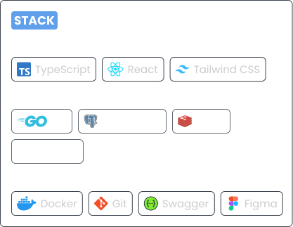

	<picture>
		<source media="(prefers-color-scheme: dark)" srcset="./assets/header/header-dark.svg" />
		<source media="(prefers-color-scheme: light)" srcset="./assets/header/header-light.svg" />
		
	</picture>
	<picture>
		<source media="(prefers-color-scheme: dark)" srcset="./assets/about/about-dark.svg" />
		<source media="(prefers-color-scheme: light)" srcset="./assets/about/about-light.svg" />
		
	</picture>
	<picture>
		<source media="(prefers-color-scheme: dark)" srcset="./assets/stack/stack-dark.svg" />
		<source media="(prefers-color-scheme: light)" srcset="./assets/stack/stack-light.svg" />
		
	</picture>
	<picture>
		<source media="(prefers-color-scheme: dark)" srcset="./assets/connect/connect-dark.svg" />
		<source media="(prefers-color-scheme: light)" srcset="./assets/connect/connect-light.svg" />
		
	</picture>

